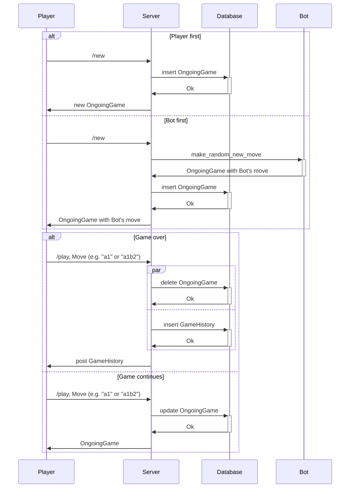
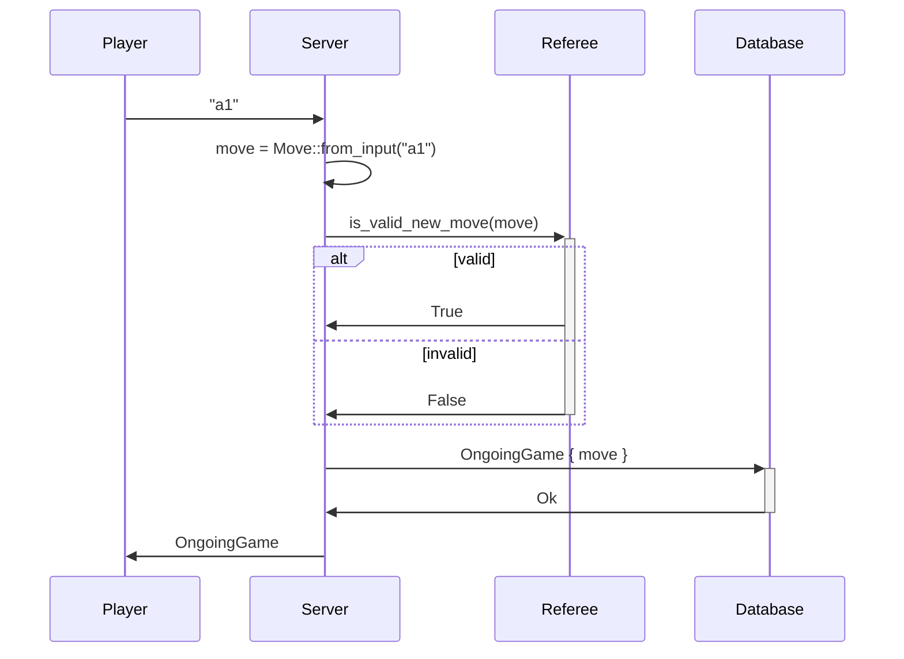

# Three mens morris

## Sequence Diagrams

### Player vs Bot sequence



### Player's placing a new piece



### Player's moving an existing piece

```mermaid
Player ->> Server: "a1b2"
Server ->> Server: move = Move::from_input("a1b2")
Server ->>+ Referee: is_valid_move(move)
alt valid
Referee ->> Server: True
else invalid
Referee ->>- Server: False
end
Server ->>+ Database: OngoingGame { move }
Database ->>- Server: Ok
Server ->> Player: OngoingGame
```