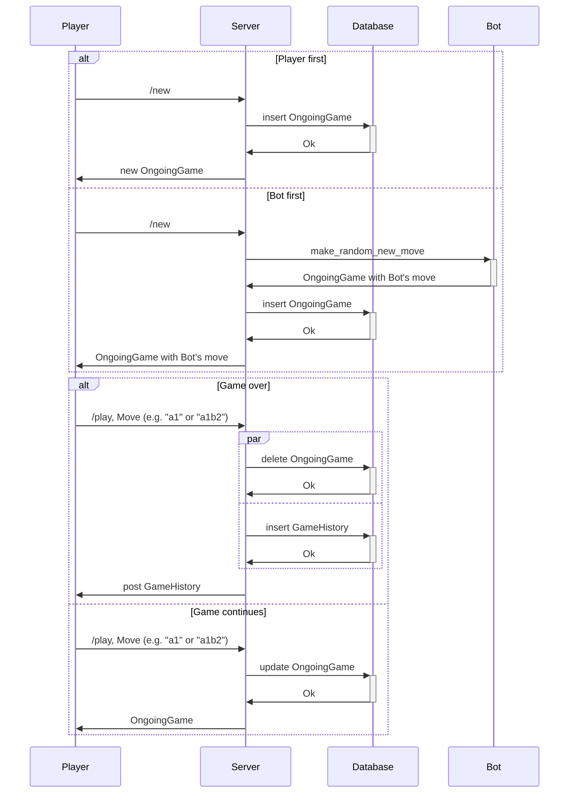

# Three mens morris

## Sequence diagram

### Player vs Bot sequence

```mermaid
sequenceDiagram

alt Player first
    Player->>Server: /new
    Server->>+Database: insert OngoingGame
    Database->>-Server: Ok
    Server->>Player: new OngoingGame
else Bot first
    Player->>Server: /new
    Server->>+Bot: make_random_new_move
    Bot->>-Server: OngoingGame with Bot's move
    Server->>+Database: insert OngoingGame
    Database->>-Server: Ok
    Server->>Player: OngoingGame with Bot's move
end


alt Game over
    Player->>Server: /play, Move (e.g. "a1" or "a1b2")

    par
        Server->>+Database: delete OngoingGame
        Database->>-Server: Ok
    and
        Server->>+Database: insert GameHistory
        Database->>-Server: Ok
    end
    
    Server->>Player: post GameHistory
else Game continues
    Player->>Server: /play, Move (e.g. "a1" or "a1b2")
    Server->>+Database: update OngoingGame
    Database->>-Server: Ok
    Server->>Player: OngoingGame
end
```
